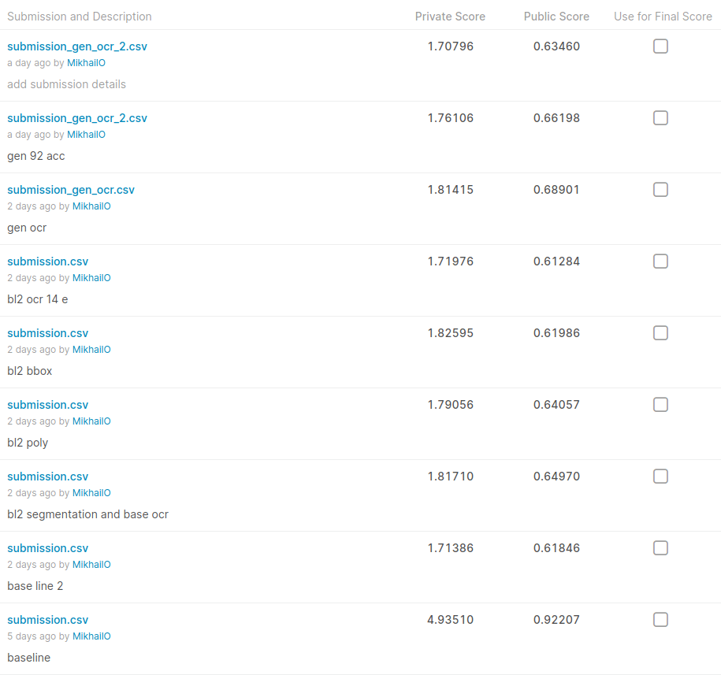

1) Попробовал использовать официальный baseline (BCEWithLogitsLoss with pos_weight, inplace_abn)
2) Использовал https://www.kaggle.com/alyar88/maskrcnn-bb-x-mask-crnn-0-53, доучил сеть для распознавания чуть дольше
3) Попробовал использовать generated_60k 
  - попортил разными трансформациями
  - вырезал номера с тестового сета
  - слил вместе и использовал для тренеровки модель из официального baseline
  - использовал Resnet34 вместо Resnet18
  - на public не получилось улучшить скор, на private оказался чуть лучше чем baseline

